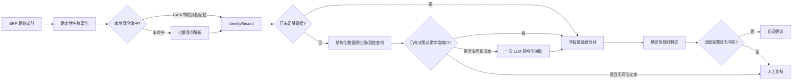

# 目标架构与数据契约

## 目标流程



## 模块边界

| 模块 | 责任 | 明确不负责 |
|---|---|---|
| `name_normalizer.py` | 纯本地清洗、CAS 提取/校验、浓度/等级/包装拆分、查询词种子 | LLM、网络查询、判定类别 |
| `reagent_identity.py`（新增） | 身份候选、冲突处理、审核别名和记忆命中、IdentityRecord | 物性抽取、审批规则 |
| `chemical_sources/`（新增） | PubChem、可选 CompTox、NIST、Supplier SDS 适配器 | 跨源覆盖、最终判定 |
| `chemical_searcher.py` | 批次规划、single-flight、预算、熔断、provider 调度 | HTML 细节解析、LLM prompt、规则判断 |
| `evidence_resolver.py`（新增） | 字段归一化、单位换算、来源优先级、冲突保留、缺口分析 | 身份猜测、审批写入 |
| `llm_extractor.py` | 从指定可信文本抽取指定缺失字段，返回 evidence span | 搜索调度、模型知识自动判定 |
| `rule_engine.py` | 基于标准字段和规则版本做确定性判定 | 网络、名称清洗、LLM 调用 |
| `approval_flow.py` | 编排批次、影子对比、人工复核和结果输出 | provider 解析细节 |

## 核心数据契约

### IdentityRecord

```json
{
  "identity_id": "cas:64-17-5",
  "raw_name": "无水乙醇 AR 500mL",
  "cleaned_base_name": "乙醇",
  "standard_name_cn": "乙醇",
  "standard_name_en": "Ethanol",
  "cas": "64-17-5",
  "cid": "702",
  "inchikey": "LFQSCWFLJHTTHZ-UHFFFAOYSA-N",
  "concentration": null,
  "grade": "AR",
  "package": "500 mL",
  "mixture_state": "single_substance",
  "status": "verified",
  "confidence": 0.99,
  "evidence_refs": ["ev-identity-001"],
  "conflicts": []
}
```

`status` 只允许：`verified`、`name_only`、`ambiguous`、`conflict`、`unresolved`。只有 `verified` 可以进入无需人工身份核对的自动路径。

### EvidenceItem

```json
{
  "evidence_id": "ev-phys-001",
  "identity_id": "cas:64-17-5",
  "field": "flash_point",
  "raw_value": "13 °C (closed cup)",
  "normalized_value": 13.0,
  "unit": "degC",
  "qualifier": "closed_cup",
  "source_id": "pubchem_pug_view",
  "source_url": "https://pubchem.ncbi.nlm.nih.gov/compound/702",
  "source_tier": 2,
  "retrieved_at": "2026-09-10T00:00:00Z",
  "extraction_method": "json_path",
  "evidence_span": "",
  "confidence": 0.90,
  "status": "observed"
}
```

`status` 只允许：`observed`、`reported`、`predicted`、`unknown`、`conflict`。规则必须能区分 `false` 与 `unknown`。

### ResolvedProperties

```json
{
  "identity_id": "cas:64-17-5",
  "fields": {
    "flash_point": {"value": 13.0, "unit": "degC", "status": "observed", "evidence_refs": ["ev-phys-001"]},
    "oxidizing": {"value": false, "status": "reported", "evidence_refs": ["ev-hazard-004"]},
    "acute_oral_ld50_mg_kg": {"value": null, "status": "unknown", "evidence_refs": []}
  },
  "coverage": 0.75,
  "conflicts": [],
  "missing_decision_fields": []
}
```

### DecisionTrace

```json
{
  "identity_id": "cas:64-17-5",
  "rule_version": "rules_structured.xlsx:sha256:...",
  "matched_rule_ids": ["R-FLAM-001"],
  "evidence_refs": ["ev-phys-001"],
  "final_category": "易燃液体",
  "confidence": 0.95,
  "need_manual_review": false,
  "reason_codes": ["FLASH_POINT_BELOW_THRESHOLD"],
  "warnings": []
}
```

## 数据源优先级

1. 已审核的供应商 SDS / 用户提供 SDS：商品试剂、溶液、混合物的首选。
2. 已审核本地记忆和别名：只在身份键一致、规则版本兼容时复用。
3. PubChem PUG REST：身份、同义词、CID、结构与基础属性。
4. PubChem PUG View：危害和实验/汇总物性，字段级记录原始来源。
5. EPA CompTox：配置 API key 后提供第二身份/物性/毒性来源，支持批次。
6. NIST WebBook：适用字段的实验物性补充。
7. 中文商业网站：后台补充或人工链接，不参与同步 SLA 和自动判定必要条件。
8. LLM 模型知识：仅作为人工复核意见，不进入 `observed/reported` 证据。

## 缓存设计

拆分四类缓存：

- `identity_cache`：按 CAS、审核别名或规范化名称保存身份候选；成功 180 天，歧义 24 小时。
- `source_response_cache`：保存原始 provider 响应及 ETag/Last-Modified；按 source 和资源 ID 定 TTL。
- `evidence_cache`：保存字段级证据，key 为 `identity_id + source + schema_version`。
- `llm_extraction_cache`：key 为 `evidence_hash + prompt_version + schema_version + model`；只缓存抽取结果，不缓存网络故障。

临时网络失败只记录运行事件和熔断状态，不写成“未找到”。确定性 404 可以短期负缓存 6 小时。成功旧数据在数据源故障时可 stale-if-error，但必须标记时间和人工复核要求。

## 调度与预算

- 页面内先去重，再按身份候选分组。
- 第一批：CAS/名称 → CID/DTXSID，优先使用批量接口。
- 第二批：仅对缺失决策字段的身份拉取详情。
- 每个 provider 单独限制并发、速率、超时和熔断；重试只用于 429、502、503、504 和网络超时，使用 jitter 与 Retry-After。
- 一个 20 条页面共用总预算，不给每条记录叠加完整 30 秒预算。
- 达到预算时，已完成项继续判定，未完成项进入人工复核，并保留可恢复的 pending 状态。
